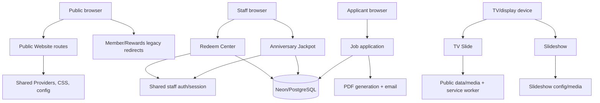

# Architecture and system-boundary map

## Repository shape

The `main` branch is one Next.js App Router deployment containing the public website, two staff systems, a public job application flow, two display implementations, PDF generation, and shared configuration/data. This is operationally convenient, but the authentication, CSS, build, and Neon dependency boundaries are not fully independent.

## Requested system classification

| # | System | Primary paths/files | Keep in this repository? | Boundary notes |
|---:|---|---|---|---|
| 1 | Public Website | `app/`, `components/official-site.tsx`, `lib/site.ts`, `lib/official-i18n.ts` | Yes | Core public SEO, content, services, contact, promotion, and booking surface. |
| 2 | Member / Rewards Redirect | `app/rewards/page.tsx`, `app/login/page.tsx`, `config/member-center.ts`, `config/navigation.ts` | Yes for compatibility | Keep thin and canonical; remove the old local UI only after owner confirmation. |
| 3 | Redeem Center | `app/redeem/*`, `app/api/redeem/*`, `lib/redeem/*`, `db/migrations/001_create_redeem_codes.sql` | Short term yes; future split candidate | Staff-only, transactional, separate data table, but shares auth/CSS/package. |
| 4 | Anniversary Jackpot | `app/anniversary-jackpot/*`, `app/api/anniversary-jackpot/*`, `lib/jackpot/*`, `db/migrations/003_create_anniversary_jackpot.sql` | Short term yes; future split candidate | Higher-risk draw/audit operations; shares staff session with Redeem. |
| 5 | Job Application | `app/job/*`, `app/api/job/*`, `lib/job/*`, `lib/email/*`, `db/migrations/002_create_job_applications.sql` | Could remain while volume is low | Public input plus sensitive applicant data, PDF, email, and DB-backed abuse controls. |
| 6 | TV Slide | `app/tv-slide`, `components/tv/*`, `lib/tv-slideshow.ts`, `public/data/slideshow.json`, `public/sw-tv-slide.js` | Future static/display app candidate | Device/display runtime and service worker are unlike normal website traffic. |
| 7 | Slideshow | `app/slideshow`, `components/slideshow/*`, `config/slideshow-display.ts` | Future display app candidate | Separate implementation from TV Slide; documentation currently describes it incorrectly. |
| 8 | PDF Generation | `lib/job/pdf.ts`, `app/api/anniversary-jackpot/winners/pdf/route.ts`, `scripts/prepare-pdf-assets.mjs`, `public/pdf-assets` | Prefer shared internal package first | Node/asset-heavy work should not leak into public UI bundles. |
| 9 | Authentication | `lib/redeem/auth.ts`, `lib/redeem/http.ts`, `components/redeem/staff-login-form.tsx` | Shared utility only if scopes are explicit | Current session is shared by Redeem and Jackpot (`SEC-005`). |
| 10 | Shared Config | `lib/site.ts`, `config/member-center.ts`, `config/navigation.ts`, `config/slideshow-display.ts` | Yes | Centralize production origins; current sitemap/metadata literals bypass `lib/site.ts`. |
| 11 | Shared Database | `lib/redeem/db.ts`, `lib/job/db.ts`, `lib/jackpot/db.ts`, `@neondatabase/serverless`, `db/migrations/*` | Short term yes | Same dependency/connection environment, separate tables; migration runners are non-transactional. |
| 12 | Shared UI | `app/globals.css`, `components/providers.tsx`, common components, icon libraries | Yes, but reduce scope | Global CSS and provider apply to every route, including internal tools and displays. |

## Coupling records

### ARCH-001 — Redeem and Jackpot share authentication and CSS

- **Issue ID:** ARCH-001
- **Title:** Staff systems are not isolated security/UI boundaries
- **Risk:** Medium
- **Status:** Confirmed
- **File path:** `lib/redeem/auth.ts:65-112`; `lib/jackpot/http.ts:2-4`; `app/anniversary-jackpot/page.tsx:5,9-16`; `app/anniversary-jackpot/layout.tsx:2-3` imports both `../redeem/redeem.css` and Jackpot CSS.
- **Problem:** One session/cookie and merged credential sources serve both systems, while Jackpot also imports Redeem styling.
- **Current impact:** Changes to staff authentication or Redeem CSS can affect Jackpot; a shared session increases authorization blast radius.
- **Recommendation:** Separate auth cookies/scopes first, then split CSS roots. Preserve a deliberate shared design-token package if desired.
- **Safe to delete?:** No.
- **Delete-before verification:** Endpoint authorization matrix, staff-role test matrix, screenshot comparison, secret rotation in staging, and logout/isolation tests.

### ARCH-002 — One deployment contains seven materially different workloads

- **Issue ID:** ARCH-002
- **Title:** Public, staff, applicant, PDF, and display workloads share one build/deploy boundary
- **Risk:** Medium
- **Status:** Confirmed
- **File path:** `package.json:7-16` (build, migrations, asset prep); route tree under `app/`; dependencies include Neon, PDFKit, Sharp, QRCode, Framer Motion, and two icon libraries.
- **Problem:** A public-site deployment packages internal staff workflows, applicant PII processing, PDF/email generation, and long-lived display/service-worker assets.
- **Current impact:** A dependency/build/config change for one system can block or alter the official website deployment. Rollback and least-privilege ownership are harder.
- **Recommendation:** Keep one repository short term, but define deployment targets and ownership boundaries. Future extraction should start with staff transaction systems and display surfaces, not shared public config.
- **Safe to delete?:** No.
- **Delete-before verification:** Map environment variables, database tables, deployment triggers, domains, and rollback procedures before changing project boundaries.

### ARCH-003 — Global Provider and stylesheet span all systems

- **Issue ID:** ARCH-003
- **Title:** Public language/theme state and global CSS wrap internal routes
- **Risk:** Medium
- **Status:** Confirmed
- **File path:** `app/layout.tsx:1-65` wraps all pages with `Providers` and `app/globals.css`; `components/providers.tsx:16-52` owns locale/theme state; `app/globals.css` contains 647 rules.
- **Problem:** Internal pages inherit public language storage, forced-light theme setup, global tokens, and unrelated selectors. Route CSS then adds `:has()`/`!important` overrides.
- **Current impact:** A global UI refactor can affect staff screens, job forms, and display pages; the CSS audit found 14 global `!important` uses and 23 media queries.
- **Recommendation:** Introduce route-level shells and scoped token layers, keeping only truly shared reset/accessibility rules global.
- **Safe to delete?:** No.
- **Delete-before verification:** Render every route at mobile/desktop, test language persistence and hydration, and run accessibility/focus/reduced-motion checks.

### ARCH-004 — Display implementations duplicate the same product boundary

- **Issue ID:** ARCH-004
- **Title:** `/slideshow` and `/tv-slide` are parallel display apps in one deployment
- **Risk:** Medium
- **Status:** Confirmed
- **File path:** `app/slideshow/page.tsx:1-13`, `components/slideshow/*`, `app/tv-slide/page.tsx:1-27`, `components/tv/*`, `public/sw-tv-slide.js:108-113`.
- **Problem:** The two routes have separate configs, layouts, media paths, and behavior. The docs call one a redirect, but tests confirm they are intentionally separate today.
- **Current impact:** Device operators and maintainers can update one display without updating the other; service-worker caching makes route consolidation non-trivial.
- **Recommendation:** Define a single display contract or explicitly document two products. A future static display package/app can consume a versioned JSON schema.
- **Safe to delete?:** No.
- **Delete-before verification:** Device inventory, offline/cache test, QR/link scan, screenshot comparison, and a staged migration of display URLs.

## Large-file complexity inventory

All listed files exceed the requested 300-line TS/TSX threshold; the first four CSS files exceed the requested 300-line CSS threshold. These are refactor candidates, not deletion findings.

| File | Lines | Mixed responsibility observed | Suggested split |
|---|---:|---|---|
| `components/jackpot/jackpot-console.tsx` | 930 | UI, state, fetch API, CSV import, prizes, draws, audit feedback | `useJackpotState`, API client, participant/prize/draw panels, CSV adapter |
| `components/job/job-application-experience.tsx` | 905 | Form, draft/session storage, validation, submit/retry/PDF, analytics | Form sections, draft hook, submit client, status/retry view |
| `components/legal-document.tsx` | 812 | Five full legal documents plus renderer/locale navigation | Document data modules, renderer, language/related-links components |
| `components/tv/tv-slideshow.tsx` | 605 | Data fallback, service worker, fullscreen/keyboard, QR generation, presentation | Data hook, device controls, QR component, slide renderer |
| `lib/jackpot/service.ts` | 583 | DB reads/mutations, draw policy, audit and row mapping | Repository, draw policy, audit service, DTO mapping |
| `lib/promotion/campaign-copy.ts` | 561 | Multi-locale campaign and terms copy | Locale files and typed copy loader |
| `components/promotion/promotion-experience.tsx` | 481 | Campaign sections, language/storage, analytics/share flow | Section components, tracking hook, share client |
| `components/redeem/redeem-center.tsx` | 416 | Staff table UI, filters, mutations, feedback | Data hook, table, filter bar, mutation dialogs |
| `lib/job/pdf.ts` | 370 | PDF layout, font loading, content mapping, failure handling | Font/runtime loader, document builder, layout helpers |
| `lib/services.ts` | 307 | Localized catalog data and service constructors | Category data files only if catalog ownership requires it |
| `app/promotion/promotion.css` | 1,226 | One page's responsive/legacy visual rules | Component modules by campaign section |
| `components/tv/tv-slideshow.module.css` | 849 | Display stage, controls, responsive/device states | Stage, controls, QR, responsive modules |
| `components/slideshow/mezzanail-slideshow.module.css` | 381 | Full display composition plus global state selectors | Scoped display shell plus global activation class |
| `app/globals.css` | 323 | Public, job, service, consent, and shared styles | Keep reset/accessibility/tokens only; move route styles |

## Keep vs split recommendation

### Continue sharing

- Public website content, `lib/site.ts`, typed service data, official localization, and a small accessible UI foundation are coherent.
- PDF font/layout helpers can remain a package shared by Job and Jackpot if they have no database/auth imports.
- A versioned slideshow schema and media-preparation utilities can be shared by display products without sharing page UI.

### Future split candidates

1. **Redeem + Jackpot:** separate staff sessions/cookies, environment scopes, and preferably deployment ownership; keep a shared audited auth package only if roles are explicit.
2. **TV Slide + Slideshow:** move to a static display app or package after choosing one contract and migrating devices/cache.
3. **Job application:** isolate PII/email/PDF handling if application volume or compliance requirements grow.
4. **PDF generation:** move to an internal worker/package when build/runtime asset weight becomes a deployment concern.

### Changes likely to affect official-site deployment

- Root `Providers`, `app/globals.css`, `lib/site.ts`, `config/navigation.ts`, and `package.json` affect nearly every route.
- Neon dependency/build scripts affect internal systems and can fail the whole build even when the public site is unchanged.
- Shared domain/redirect changes affect SEO, QR scans, member links, and deployment host behavior.

No architecture split or code refactor was performed in this audit.
